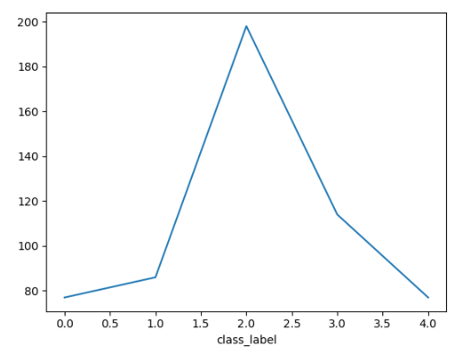
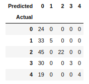
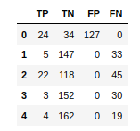
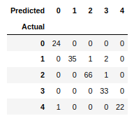
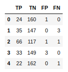

Author: Emre Tarakcı

### Tools and libraries used
#### Python
For this project, I have used Python programming language becase of its simplicity and the available libraries.
#### Jupyter Notebook
Jupyter Notebook provides visual representations and taking notes in the same platform as the code, while allowing code execution block by block. This makes it easy to divide the code into segments and run the needed segments at each stage.
#### Pandas
For visually representing data and making operations using DataFrames, I have used **pandas** library. Pandas creates a good representation of two-dimentional arrays, makes it easy to work with `.csv` files and data manipulation can be done efficiently and easily without having to use for loops for iterating through matrices. 
#### Numpy
Numpy is useful for creating the arrays using numpy arrays before turning them into DataFrames in pandas. Also, it allows turning *-inf* values in the code to numerical representations to make calculations with *-inf* possible.

### Evaluation
#### 1.
- The class distribution in the training set is as follows:
	- athletics: 77
	- cricket: 86
	- football: 198
	- rugby: 114
	- tennis: 77

#### 2.
The training set is skewed towards football class. The impalanced training set does affect the model because the model will have a tendency to predict an article as football because of the increase of the term $P(Y=y_k)$ in the model.
#### 3.
- The validation data class distribution is as follows:
	- athletics: 24
	- cricket: 38
	- football: 67
	- rugby: 33
	- tennis: 23 
This distribution is also skewed towards football and has a similar distribution. The number of cricket classes is more compared to the training data.
If there is a bad split, the model will be misleading due to the term $P(Y=y_k)$. This is because if a class occurs more in the training data, the model will predict the probability of that class to occur in the future to be more than the other classes. If the split is not done well, this term misleads the model.
#### 4.
In my dataset, both the training and validation data are skewed towards football class. Since the case persists for both of them, my validation shows me that the results are quite high in accuracy (0.9892 with dirichlet). However, if the actual values in the real world are not skewed in a similar way, the reported accuracy will be far from the actual accuracy. That is why the dataset samples need to be acquired carefully to represent the real-life situation. Otherwise, the model may not be successful although it may have a high validation accuracy.

### Question 2.2
Without fair dirichlet prior, the model had a low accuracy of 0.7254 with the following confusion matrix:

- Accuracy: 0.7254
- Wrong predictions: 127

### Question 2.3
With fair dirichlet prior, the accuracy of the model increased substantially.

- Accuracy: 0.9892
- Wrong predictions: 5

### Question 2.4
The difference between the model using fair Dirichlet prior and the one without smoothing occurs when a word that does not occur in the training set of a label does occur in the validation data. For example, if the word "hello" does not occur in any of the training data under label *tennis*, the probability of this word occuring in this label is trained as zero. When the word "hello" does occur in a validation article of label tennis, the probability equals zero. When the fair Dirichlet prior is added, the non-existing words in the vocabulary do not make the probability zero. The model has more tolerance towards new data that includes words that the model was not trained for.

# References
- _Naive Bayes classifiers_. GeeksforGeeks. (2022, August 24). Retrieved October 27, 2022, from https://www.geeksforgeeks.org/naive-bayes-classifiers/
- victorlavrenko. (2015, September 18). _LM.10 Dirichlet smoothing_. YouTube. Retrieved October 30, 2022, from https://www.youtube.com/watch?v=VY3coNGm2Es&ab_channel=VictorLavrenko

# Code

import pandas as pd
import numpy as np
dirichlet = True
training_data = pd.read_csv(r'bbcsports_train.csv')
validation_data = pd.read_csv(r'bbcsports_val.csv')
def predict_value(argument):
    max_result = label_probabilities[0]
    for j in range(4613):
        max_result += argument[j] * word_probabilities.iloc[0][j]
    class_id = 0
    for k in range(1, 5):
        result = label_probabilities[k]
        for j in range(4613):
            result += argument[j] * word_probabilities.iloc[k][j]
        if result > max_result:
            max_result = result
            class_id = k
    return class_id
label_document_count = training_data.groupby(['class_label']).size()
label_document_count.plot()
label_count = int(label_document_count.count())
display(label_document_count)
val_label_document_count = validation_data.groupby(['class_label']).size()
val_label_document_count.plot()
display(val_label_document_count)
label_probabilities = label_document_count / label_document_count.sum()
display(label_probabilities) 
label_probabilities = np.log(label_probabilities)
occurances_of_words = training_data.groupby(['class_label']).sum()
if(dirichlet):
    occurances_of_words += 1

display(occurances_of_words)
label_word_count = occurances_of_words.sum(axis=1)
display(label_word_count)

word_probabilities = occurances_of_words.div(label_word_count, axis='rows')
display(word_probabilities)
word_probabilities = np.log(word_probabilities)
word_probabilities = word_probabilities.replace(-np.inf, np.nan_to_num(-np.inf))
display(word_probabilities)

validation_labels = pd.DataFrame(validation_data[["class_label"]], dtype='int32')
validation_row_count = validation_labels.count()['class_label'].astype(int)

predictions = np.array([])
for i in range(0, validation_row_count):
    row = validation_data.loc[i,:]
    row_prediction = predict_value(row)
    predictions = np.append(predictions, [int(row_prediction)])
prediction_labels = pd.DataFrame(predictions, dtype='int32', columns=['predicted_label'])
pred_results = pd.concat([validation_labels, prediction_labels], axis=1, ignore_index=True)
pred_results = pred_results.rename(columns={0: 'y_actual', 1: 'y_predicted'})
confusion_matrix = pd.crosstab(pred_results['y_actual'], pred_results['y_predicted'], rownames=['Actual'], colnames=['Predicted'])
display(confusion_matrix)
confusion_data = np.full((label_count, 4), 0, dtype=int)
confusion_values = pd.DataFrame(confusion_data, columns=['TP', 'TN', 'FP', 'FN'])
for i in range(label_count):
    TP = 0
    TN = 0
    FP = 0
    FN = 0
    for j in range(label_count):
        for k in range(label_count):
            if j == i and k == i:
                TP = confusion_matrix[j][k]
            elif j == i:
                FP += confusion_matrix[j][k]
            elif k == i:
                FN += confusion_matrix[j][k]
            else:
                TN += confusion_matrix[j][k]
    confusion_values['TP'][i] = TP
    confusion_values['TN'][i] = TN
    confusion_values['FP'][i] = FP
    confusion_values['FN'][i] = FN
display(confusion_values)
confusion_sum = confusion_values.sum()
TP = confusion_sum['TP']
TN = confusion_sum['TN']
FP = confusion_sum['FP']
FN = confusion_sum['FN']
accuracy = (TP + TN) / (TP + TN + FP + FN)
print("Accuracy: " + str(accuracy))
